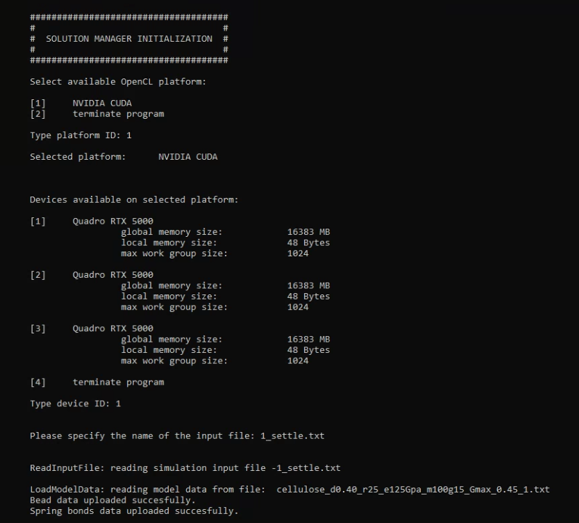

## FibreNet project documentation file


### 1. About this repository

This repository contains general-purpose particle dynamics simulation code. Its
main application is the simulation of meso-scale mechanics of fiber networks.

Basic capabilities:
* simulation of non-bonded interactions (penalty spring model used to minimize interpenetration
between the surfaces in contact, Lennard-Jones potentials, harmonic potentials)
* grid based collision detection
* simulation of fibre mechanics - axial and bending stiffness described by means of harmonic bond
and angle potentials
* integration based on modified Velocit-Verlet algorith
* periodic boundary conditions or finite simulation box

When executed code requires an input text file to run the simulations. The input text file contains informations about types of structures used, basic simulation settings, such as size of simulation box, time step, exported data types, definitions of non-bonded interactions etc.. The input file contains also path to model file. Model file is written in plain text format. Model file contains information regarding basic data structures used by simulation software - particles/beads - their initial positions, properties, connectivity.

Presented software is siutable for execution on both GPUs and CPUs. The code architecture was optimized to perform computations using GPUs, while CPU unit manages the host code. This was achieved by including the OpenCL open-source library (Khronos Group, USA). The project was written using the Microsoft Visual Studio Version 16.4.0 (Microsoft Corporation, USA). The host code was written using C++ programming language. It is responsible for managing all OpenCL instructions (managing the data buffers, compiling kernels etc.), reading input files, reading model files, writing all output data, uploading kernels. In the current version of the project all OpenCL kernels are storred in a text file "kernel.cl". This file contains all the necessary definitions of sturctures and functions to perform particle dynamics simulations. The presence of the kernel.cl file in the same directory as the executable is required to run the compiled code.
>Warning
There are no guaranties that this software will run on your machine.   


### 2. Model file format

Model file contains information regarding basic data structures used by simulation software. Model file is written in plain text format. Each line of the text define one structure. Each line begins with *keyword*, which defines the type of data structure. *Keyword* is followed by set of *parameters* describing a given structure. A **tab** sign is used as a delimiter for *keywords* and *parameters*.

Basic data structures are:
* BEADS / PARTICLES
* SPRINGS
* ANGULAR BONDS

Please note the numbering of all structures in the model file begins with zero.

#### BEAD

The most basic model structure - a particle; can be a hard sphere or soft particle depending on force field used.

```text
BEAD  [type] [tag] [group_id] [radius] [mass] [px] [py] [pz] [vx] [vy] [vz] [fx] [fy] [fz] [ix] [iy] [iz]

[type]         - string indicating used-defined bead type name; type must match
                 one of types declared in the input file;
[tag]          - positive integer value; indicates group membership; used when
                 properties of selected group are modified;
[loc_id]       - localc id of bead; positive integer value; indicates group membership
[radius]       - radius of bead;
[mass]         - mass of bead;
[px] [py] [pz] - position of bead along x,y and z axis of simulation box;
[vx] [vy] [vz] - velocity of bead along x,y and z axis;
[fx] [fy] [fz] - force of bead along x,y and z axis;
[ix] [iy] [iz] - position of bead along x,y and z axis in absolute coordinates system;
```

#### SPRING

Simple linear bond between two beads/particles. Can be permanent or break under tensile force.

```text
SPRING [type] [tag] [bead_id_1] [bead_id_2] [rest_length] [stiffness] [failure_strain]

[type]           - type of spring bond HR - harmonic; HR_FL - harmonic with
                   failure behaviour
[tag]            - positive integer value; indicates group membership; used when
                   properties of selected group are modified;
[bead_id_1]      - id number of the first bead connected with linear bond;
                   bead id's are assigned automatically starting form 0 and
                   based on their order of appearance inside model file; first
                   bead has id = 0; second id = 1; etc.
[bead_id_2]      - id number of the second bead connected with linear bond;
[rest_length]    - rest length of the bond;
[stiffness]      - stiffness of the linear bond;
[young_modulus] -  optional argument, when type "HR_FL" is used; defines the
                   value of Young's modulus of fibre, used to calculate tensile
                   stress
[failure_stress] - optional argument, when type "HR_FL" is used; defines the
                   value of failure stress, when spring bond breaks permanently
```

#### ANGLE

```text
 ANGLE [type] [tag] [bead_id_1] [bead_id_2] [bead_id_3] [spring_id_1] [spring_id_2] [rest_angle] [stiffness]

[type]         - type of angle bond HR - harmonic; HR_FL - harmonic with
                 failure behaviour
[tag]          - positive integer value; indicates group membership; used when
                 properties of selected group are modified;
[bead_id_1]    - id number of the first bead connected with angular bond;
[bead_id_2]    - id number of the second bead connected with angular bond;
[bead_id_3]    - id number of the third bead connected with angular bond;
[spring_id_1]  - id number of the spring structure connecting first and second bead;
[spring_id_2]  - id number of the spring structure connecting second and third bead;
[rest_angle]   - rest angle of the angular bond;
[stiffness]    - stiffness of the angular bond;
```

EXAMPLE OF MODEL FILE CONTENT:
```text
BEAD	C1	1	0	0.50	1.00	61.98	34.62	73.68	0.00	0.00	0.00	0.00	0.00	0.00	61.98	34.62	73.68
BEAD	C1	1	0	0.50	1.00	62.48	34.62	73.73	0.00	0.00	0.00	0.00	0.00	0.00	62.48	34.62	73.73
BEAD	C1	1	0	0.50	1.00	62.98	34.62	73.77	0.00	0.00	0.00	0.00	0.00	0.00	62.98	34.62	73.77
BEAD	C1	1	0	0.50	1.00	63.47	34.62	73.81	0.00	0.00	0.00	0.00	0.00	0.00	63.47	34.62	73.81
BEAD	C1	1	0	0.50	1.00	63.97	34.62	73.85	0.00	0.00	0.00	0.00	0.00	0.00	63.97	34.62	73.85
SPRING	HR	0	0	1	0.50	59654.11
SPRING	HR	0	1	2	0.50	59654.11
SPRING	HR	0	2	3	0.50	59654.11
SPRING	HR	0	3	4	0.50	59654.11
ANGLE	HR	0	0	1	2	0	1	3.13	1864.19
ANGLE	HR	0	1	2	3	1	2	3.14	1864.19
ANGLE	HR	0	2	3	4	2	3	3.14	1864.19
```


### 3. Simulation input file

Test file containing all information required to start simulation. This includes input file name, output data file name, simulation restart file (optional), declarations of bead types and bead interactions, solver and simulation box settings. The order of appearance of data blocks is not important. All instructions should be typed with a lowercase letter.

Input file commands:

**model_file**
```text
description:
  Path to text file containig model data.

syntax:
  model_file   [model_file_path]

arguments:
  [model_file_path] - path to model file;

example:
  model_file   cellulose_model_large.txt
```
</br>

**output_file**			
```text
description:
  Name of the file containig simlation output data.

syntax:
  output_file   [output_file_name]

arguments:
  [output_file_name] - name of the output file; depending on the output data
                       additiona suffix will be added to the main file name
                       ("_velocity", "_force" or "_coord");

example:
  output_file   HC_model_large_new_output
```
</br>

**output_freq**
```text
description:
  The number of simulation steps to be carried out before writting the output data.

syntax:
  output_freq   [number_of_steps]

arguments:
  [number_of_steps] - positive integer; number of simulation steps;  

example:
  output_freq	5000
```
</br>


**output_data**
```text
description:
  Defines the general type of the output data saved in output files. Three types
  of output data are available: bead positions, velocities and forces. Separate output
  file will be created for each output data type.

syntax:
  output_data   [data_type]

arguments:
  [data_type] - "position", "velocity" or "force"

example:
  output_data position
```
</br>

**output_type**
```text
description:
  Allows you to indicate the data of which type of beads will be written to the
  output file. This allows to limit the size of the output data files. If the bead
  type is not specified, the data for all beads will be exported.

syntax:
  output_type   [bead_type]

arguments:
  [bead_type] - character string indicating the bead type (must be the same as
                declared in input file and model file)

example:
  output_type	  C1
```
</br>

**restart_file**
```text
description:
  Defines the path and name of the simulation restart file *.res.

syntax:
  restart_file   [restart_file_path]

arguments:
  [restart_file_path] - path to simulation restart file.

example:
  restart_file	cellulose_model_large_output_restart.res
```
</br>

**restart_data**
```text
description:
  XXXXX

syntax:
  restart_data   [data_type]

arguments:
  [data_type] -

example:
  restart_data  velocity
```
</br>

**run**
```text
description:
  Number of simulation steps to calculate.

syntax:
  run   [simulation_steps]

arguments:
  [simulation_steps] - positive integer; number of simulation steps;

example:
  run   10000
```
</br>

**minimize_steps**
```text
description:
  Defines the number of simulation "warm-up" steps. This is an initial part of the
  simulation intendet to equilibrate the system energy. Data from this part of the
  simulation is not exported to output files.

syntax:
  minimize   [number_of_steps]

arguments:
  [number_of_steps] - number of simulation steps

example:
  minimize  80000
```
</br>

**minimize_substeps**
```text
description:
  Enables to split simulation "warm-up" into smaller chunks. It is used when
  "minimize_reset" flag is set to "yes". When the declared number of sub-steps of
  the simulation is completed, there will be a reset of the velocities and forces
  acting on the beads.

syntax:
  minimize_steps   [number_of_substeps]

arguments:
  [number_of_substeps] - number of simulation steps

example:
  minimize_steps	700
```
</br>

**minimize_reset**
```text
description:
  Indicates whether the program should reset the velocities and forces acting on the beads during the energy minimization process, after completing the specified number of simulation sub-steps.

syntax:
  minimize_reset   [flag]

arguments:
  [flag] - "yes" or "no" flag

example:
  minimize_reset		yes
```
</br>

**step**
```text
description:
  Time step size per single simulation calculation step.

syntax:
  step   [time_step_size]

arguments:
  [time_step_size] - positive floating point number describing the time step size;

example:
  step	0.0001
```
</br>

**cutoff**
```text
description:
  Non-bonded interactions range. Beads do not interact via non-bonded potentials
  if separated by longer distance.

syntax:
  cutoff   [range]

arguments:
  [range] - positive floating ponint number;

example:
  cutoff	1.0
```
</br>

**lambda**
```text
description:
  Modified Velocity-Verlet integrator parameter.

syntax:
  lambda   [value]

arguments:
  [value] - positive floating point number in the range of 0.0 to 1.0;

example:
  lambda	0.5
```
</br>

**damping**
```text
description:
  Global dumping/drag force coefficient.

syntax:
  damping   [value]

arguments:
  [value] - positive floating point number;

example:
  damping	  1.5
```
</br>

**gravity**
```text
description:
  Gravity force vector.

syntax:
  gravity   [gx]  [gy]  [gz]

arguments:
  [gx]  [gy]  [gz] - three floating point numbers, idiciating direction and magnitude of gravity force in x,y and z directions.

example:
  gravity	  0.0   0.0   -9.81
```
</br>

**type**
```text
description:
  Defines the specific structures from a model file. All bead types used in the
  model file must be declared in the input file.

syntax:
  type   [bead_type]

arguments:
  [bead_type]   - string of characters used to describe a specific structure from a model file;

example:
  type   C1
```
</br>

**pair**			
```text
description:
  Defines the type and parameters of non-bonded interactions between beads.

syntax:
  pair   [pair_type]  [bead_type_1] [bead_type_2] [c1]  [c2]  ....

arguments:
  [pair_type]   - character string, "lj", "st" or "hs", Lennard-Johnes potentials,
                  two-step harmonic bond potential or penalty contact model;
  [bead_type_1]  
  [bead_type_2] - types of interaction beads;
  [c1], [c2] .. - force potential coefficients;
                  * penalty contact model:
                    c1 - penalty coefficient;
                  * two-step harmonic bond:
                    c1 - repulsive force coefficient
                    c2 - attraction force coefficient
                    c3 - bond rest length
                    c4 - bond cutoff distance
                  * Lennard-Johnes potential:
                    c1 - distance of potential energy minima
                    c2 - depth of potential well
                    c3 - potential cutoff

example:
  pair   hs	C1	C1	1000
  pair	 st	C1	C1	2000.0	500.0	1.00	1.03
  pair	 lj	C1	C1	1.1	    500.0	1.6
```
</br>

**grid_update_freq**
```text
description:
  Number of simulation steps after which the contact list stored in the simulations
  grid is updated. Default value is 10.

syntax:
  grid_update_freq   [value]

arguments:
  [value] - number of simulation steps

example:
  grid_update_freq	  6
```
</br>

**box_unit_cell**
```text
description:
  Defines the size of simulation grid unit cell.

syntax:
  box_unit_cell   [size]

arguments:
  [size] - size of cubic unit cell of simulation grid used to detect collisions
           between beads;

example:
  box_unit_cell   1.2
```
</br>

**box_size**
```text
description:
  Size of cuboid simulation box.

syntax:
  box_size  [size_x]  [size_y]  [size_z]

arguments:
  [size_x]  - length along x axis
  [size_y]  - length along y axis
  [size_z]  - length along z axis

example:
  box_size  120.0  40.0  250.0
```
</br>

**box_type**
```text
description:
  Defines the boundary conditions of simulation box. Possible options are periodic
  boundary conditions, infinite or finite box with rigid walls.

syntax:
  box_type  [type_name]

arguments:
  [type_name]  - pbc or finite, for periodic boundary conditions or finite, respectively

example:
  box_type  pbc
```


**modif_bead**
```text
description:
  Enables to modify properties of selected bead or group of beads after uploding the
  model file.

syntax:
  modif_bead  [indicator_type] [indicator] [property] [value] ...

arguments:
  [indicator_type] - defines the bead selection method; posible options are:
                     "type", "id" or "tag" - for selection by bead type, bead id
                      number or tag number, respectively;

  [indicator]      - selected bead indicator - type of bead or identification numbers
  [property]       - type of property to be changed; currently available options: "mass",
                     "velocity", "skin_radius"  
  [value]          - new value to assign;

example:
    modif_bead  type    C3	mass	    0.0
    modif_bead	type    C3	velocity	0.0	0.0	0.0
```

**modif_spring**
```text
description:
  Enables to modify properties of selected spring or group of beads after uploding the
  model file.

syntax:
  modif_spring  [indicator_type] [indicator] [property] [value] ...

arguments:
  [indicator_type] - defines the bead selection method; posible options are:
                     "id" or "tag", for selection spring id number or tag number, respectively;
  [indicator]      - selected spring indicator - spring identification numbers
  [property]       - type of property to be changed; currently available options: "rest_length",
                     "stiffness", "c1" (Young's modulus) and "c2" (failure stress);
  [value]          - new value to assign;

example:
    modif_spring	tag	1	c2	7000000.0
```


Input file example:
```text
model_file          test_model.txt

output_file         test_model_settle
output_freq         50000
output_data         position
output_type         C1
output_type         C2
output_type         C3

minimize_steps  	400000
minimize_substeps   1000
minimize_reset      yes

run                 800000

lambda              0.5
damping             0.03
cutoff              1.15

box_unit_cell       1.25
box_size            111.00	41.00	192.00
box_type            finite
box_wall_re         100

type                C1
type                C2
type                C3

pair                st	C1	C1	2000.0	500.0	1.00	1.03
pair                st	C2	C2 	2000.0	500.0	1.00	1.03
pair                st	C3	C3	2000.0	500.0	1.00	1.03
pair                st	C1	C2	2000.0	500.0	1.00	1.03
pair                st	C1	C3	2000.0	500.0	1.00	1.03
pair                st	C2	C3	2000.0	500.0	1.00	1.03

modif_bead	type	C1	skin_radius	0.6
modif_bead	type	C2	skin_radius	0.6
modif_bead	type	C3	skin_radius	0.6

step                0.0001
```

### 4. Simulation output files

Currently simulation software exports all data into *.XYZ file format. The XYZ file is a chemical file format. XYZ format specifies the molecule geometry by giving the number of atoms with Cartesian coordinates that will be read on the first line, a comment on the second, and the lines of atomic coordinates in the following lines. The file format is used in computational chemistry programs for importing and exporting geometries. For each exported data type a separte output file is created.

The general standard of XYZ file used by this software is as follows:
```text
[number_of_beads_in_frame]
FRAME [simulation_step] [time_step] [box_size_x] [box_size_y] [box_size_z]
[bead_type] [X] [Y] [Z]
[bead_type] [X] [Y] [Z]
[bead_type] [X] [Y] [Z]
```

Example of output file contents:

```text
260771
FRAME	0	0.00010	111.00000	41.00000	192.00000
C1	62.43267	38.48528	74.04371
C1	62.92883	38.53411	74.00564
C1	63.42559	38.58228	73.97371
C1	63.92228	38.62974	73.94312
C1	64.41902	38.67600	73.91435
C1	64.91684	38.71324	73.88955
C1	65.41514	38.74277	73.86693
C1	65.91435	38.75716	73.84760
C1	66.41398	38.75830	73.83040
C1	66.91309	38.73811	73.81577
C1	67.41132	38.69516	73.80389
```


Software allows to save intermediate or final simulation data, required to restart the simulation from the last completed step. The restart file is written as plain text file with *.res extension. The general standard of restart file used by this software is similar to XYZ file format, however it contains additional data fields (positions, velocities, forces and absolute positions of beads):

```text
[number_of_beads_in_frame]
FRAME [simulation_step] [time_step] [box_size_x] [box_size_y] [box_size_z]
[bead_type] [X] [Y] [Z] [VX] [VY] [VZ] [FX] [FY] [FZ] [IX] [IY] [IZ]
[bead_type] [X] [Y] [Z] [VX] [VY] [VZ] [FX] [FY] [FZ] [IX] [IY] [IZ]
[bead_type] [X] [Y] [Z] [VX] [VY] [VZ] [FX] [FY] [FZ] [IX] [IY] [IZ]
```
Example of restart file contents:
```text
202988
FRAME	50000	0.0001	152	60	232
	C1	18.2936	34.432	184.938	18.2936	34.432	184.938	-0.0021	 0.005	 0.064	-0.006	-0.019	-0.000
	C1	18.6101	34.616	184.426	18.6101	34.616	184.426	-0.0014	-0.005	-0.060	-0.008	 0.041	 0.033
	C1	18.9245	34.770	183.902	18.9245	34.770	183.902	-0.0071	 0.005	-0.057	 0.026	-0.082	-0.035
	C1	19.2434	34.861	183.366	19.2434	34.861	183.366	-0.0060	-0.018	 0.050	-0.023	 0.088	 0.024
	C1	19.5726	34.914	182.832	19.5726	34.914	182.832	 0.0041	-0.002	-0.067	-0.020	-0.031	 0.047
	C1	19.9048	34.891	182.297	19.9048	34.891	182.297	 0.0002	-0.015	-0.067	 0.082	-0.032	-0.119
  ....
```
### 5. Running the code
Before running the code, it is necessary to prepare the simulation input data
file and the model file. These files should be placed in the same directory as
the code executable file. The "kernel.cl" file with the device code must also be
located in the same directory.

The input file must have all the necessary definitions of simulation conditions,
as well as data types and output file names. After running the code, the user will
be asked to select one of the available OpenCL platforms, from a list of those
available on the device. Selection is made by typing the number of the platform
from the list and confirming the selection with the enter key. The user is then
asked to select one of the devices available on the chosen platform. Finally,
the user is prompted to specify the name of the batch file by typing its name
along with the file extension and confirming with the enter key.



